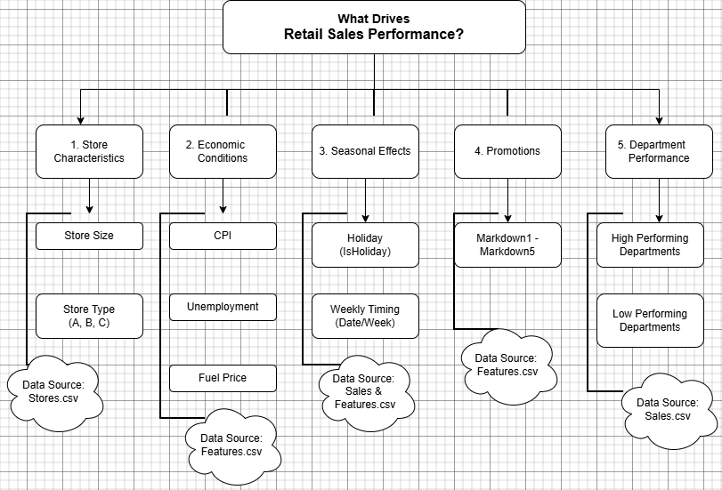

# Drivers of Retail Sales Performance: A Retail Data Analytics Project

## 📌 Project Overview

This project investigates the factors that may influence retail sales performance across **45 stores** and multiple departments.

Using historical retail sales data, the analysis aims to understand how **store characteristics, economic conditions, seasonal effects, and promotional activities** may influence weekly sales performance.

The goal is to transform structured numerical retail data into meaningful business insights that support better decision-making.

**Current Stage:**  
✅ **Business Understanding & Project Framing**

---

## 🎯 Business Problem

Retail sales performance varies across stores and departments, making it difficult for management to understand what drives changes in sales performance.

The business seeks to understand the key drivers of retail sales performance in order to improve:

- Inventory planning  
- Promotion effectiveness  
- Operational decision-making  
- Resource allocation  
- Sales performance

---

## ❓ Key Business Questions

The project aims to answer the following business questions:

| Category | Business Question |
|----------|-------------------|
| Store Characteristics | Which stores generate the highest weekly sales? |
| Store Characteristics | Do larger stores generate higher weekly sales? |
| Store Characteristics | Does store type influence sales performance? |
| Seasonal Effects | Do holiday weeks generate higher sales than non-holiday weeks? |
| Seasonal Effects | Are there clear seasonal sales patterns over time? |
| Promotions | Do promotional markdowns improve sales performance? |
| Promotions | Which markdown categories influence sales the most? |
| Economic Conditions | Does unemployment affect retail sales performance? |
| Economic Conditions | Do fuel prices influence retail sales performance? |
| Department Performance | Which departments contribute most to total retail sales? |

---

## 🧠 Business Methodology

This project follows a structured business analysis approach inspired by **McKinsey-style problem solving**.

The analytical process follows:

```text
Business Understanding
        ↓
Dataset Understanding
        ↓
Problem Definition (5 W's)
        ↓
MECE Problem Structuring
        ↓
Business Questions
        ↓
Hypothesis Development
        ↓
SQL Analysis
```

To avoid random analysis, the problem was structured using the **MECE Framework (Mutually Exclusive, Collectively Exhaustive)**.

The main drivers investigated include:

- Store Characteristics  
- Economic Conditions  
- Seasonal Effects  
- Promotions  
- Department Performance

---

## 🌳 MECE Framework

The business problem:

> **"What drives retail sales performance?"**

was broken into logical categories to create a structured analytical roadmap.



---

## 🗂️ Dataset Overview

The project uses three datasets that collectively explain retail sales performance.

| Dataset | Purpose |
|----------|----------|
| `sales.csv` | Explains **what happened** in terms of weekly sales performance |
| `features.csv` | Explains **what may have influenced performance** through economic and promotional factors |
| `stores.csv` | Explains **store-level characteristics** such as type and size |

### Key Variables
- Weekly Sales
- Store Size
- Store Type
- CPI (Consumer Price Index)
- Unemployment
- Fuel Price
- Promotional Markdowns
- Holiday Indicators

---

## ⚠️ Dataset Limitations

This project acknowledges several limitations in the dataset:

- Product categories are not explicitly provided.
- Departments are represented numerically and anonymized.
- Exact store locations are not included.
- Store type classifications (`A`, `B`, `C`) are not formally defined.

As a result, this analysis focuses on **numerical relationships and business patterns** rather than assumptions about specific products sold.

---

## 🛠️ Tools Used

| Tool | Purpose |
|------|---------|
| SQL (MySQL) | Data querying and analysis |
| Excel | Initial dataset inspection |
| Git & GitHub | Version control |
| Markdown | Documentation |
| Draw.io | MECE framework visualization |

---

## 📂 Repository Structure

```text
drivers_of_retail_sales_performance/
│
├── README.md
│
├── datasets/
│   ├── raw/
│   └── processed/
│
├── documentation/
│   ├── 01_business_understanding.md
│   ├── 02_dataset_understanding.md
│   ├── 03_mckinsey_problem_definition_framework.md
│   ├── 04_mece_framework.md
│   ├── 05_business_questions.md
│   └── 06_hypotheses.md
│
├── sql/
│
├── visuals/
│   └── mece_framework.png
│
└── insights/
```

---

## 📊 Data Source

| Item | Details |
|------|----------|
| Dataset | Retail Data Analytics |
| Source | Kaggle |
| Uploader | Manjeet Singh |
| Dataset Link | https://www.kaggle.com/datasets/manjeetsingh/retaildataset |
| License | CC0: Public Domain |

This dataset is publicly available and used for **educational, portfolio, and analytical learning purposes**.

---

## 🚀 Project Status

### Completed
- [x] Business Understanding  
- [x] Dataset Understanding  
- [x] Problem Definition (5 W's)  
- [x] MECE Problem Structuring  
- [x] Business Questions  
- [x] Hypothesis Development  
- [x] Documentation  

### Upcoming
- [ ] Data Cleaning  
- [ ] SQL Exploratory Data Analysis (EDA)  
- [ ] Data Quality Checks  
- [ ] Sales Driver Analysis  
- [ ] Business Insights  
- [ ] Recommendations

