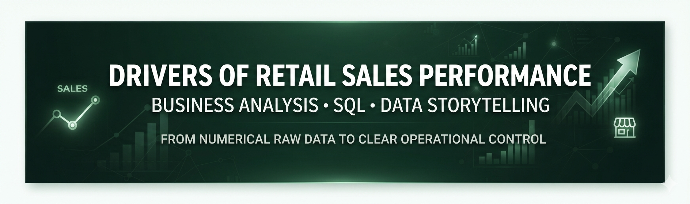
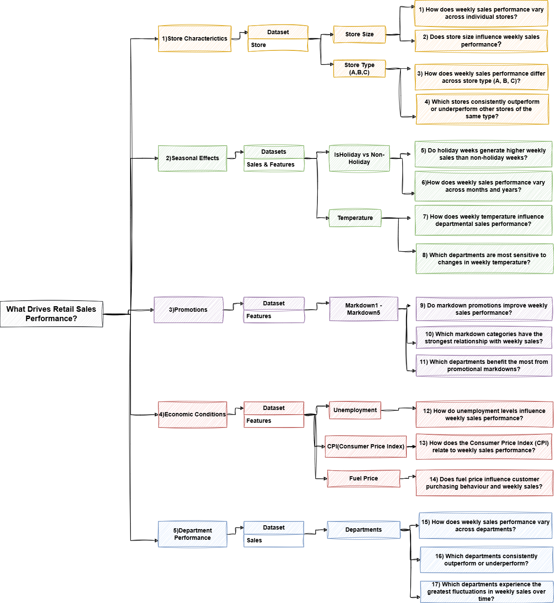
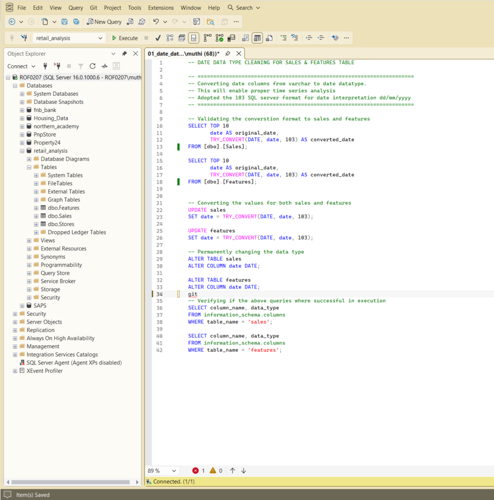
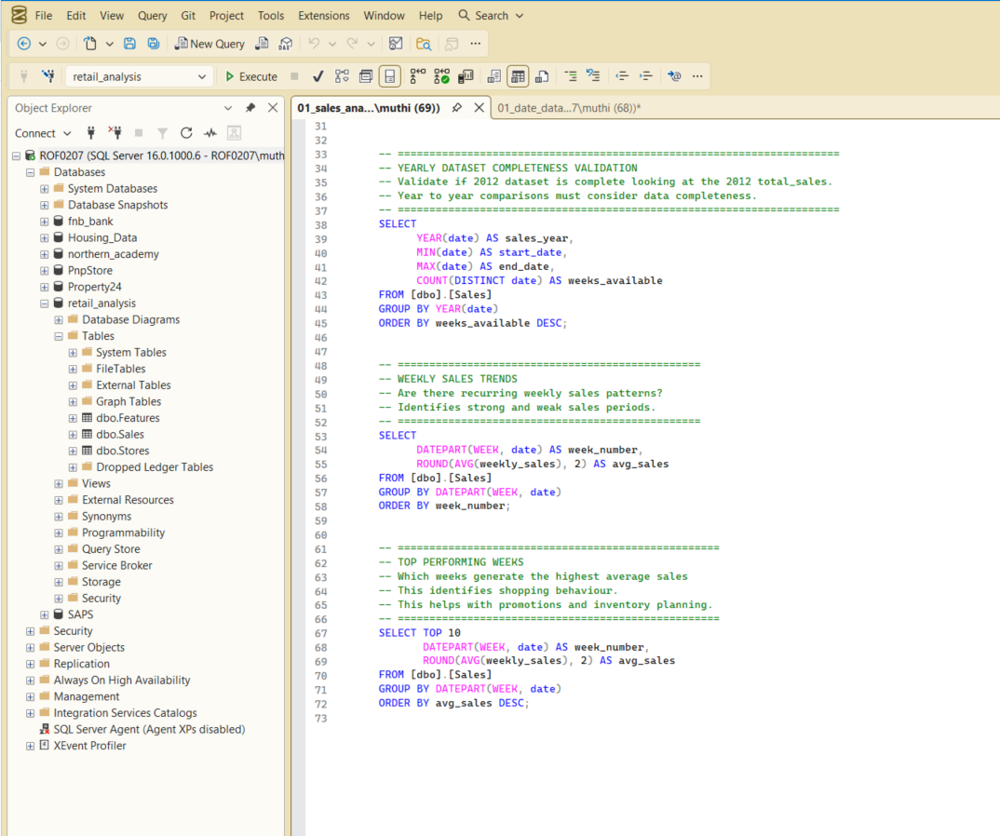
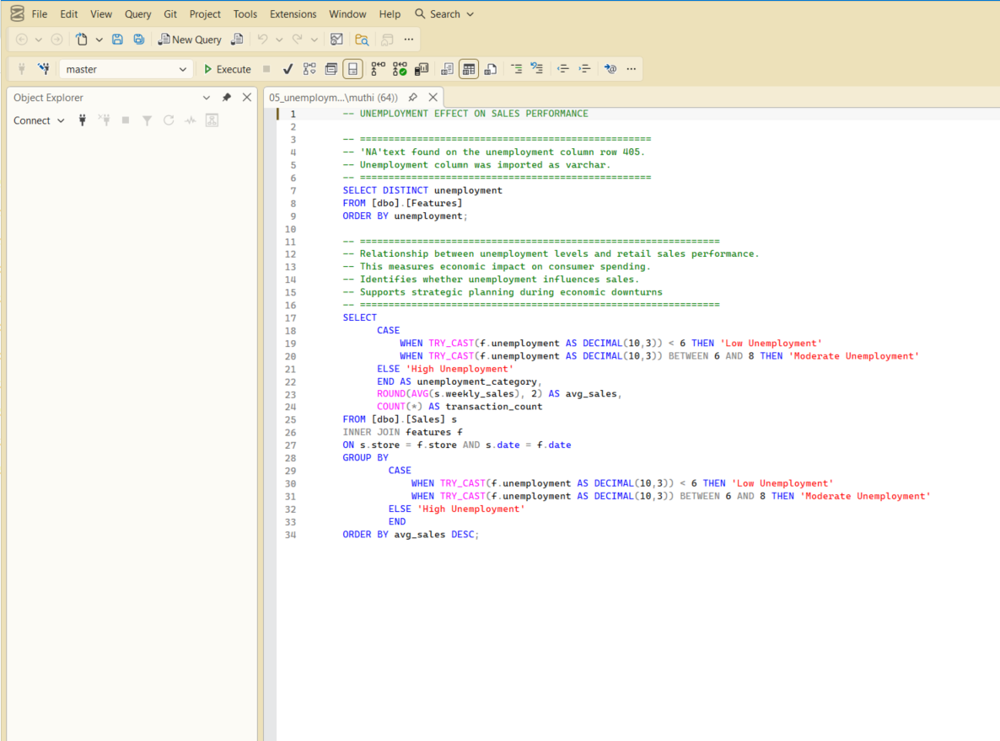

<p align="center">
  
</p>

---

##  **Project Overview** 📖

This project is based on a retail sales dataset that presents a common business challenge faced by small to large retail organizations.

Sales performance varies across stores, departments, but the reasons behind those differences are not immediately clear.

As a data analyst, my role is to investigate the factors that may be driving these changes in sales performance. Using SQL and a structured business analysis approach, I explore how store characteristics, promotional markdowns, seasonal events, and economic conditions may influence weekly retail sales.

Rather than jumping straight into writing SQL queries, this project begins by understanding the business problem, defining the right analytical questions, and developing hypotheses before performing the analysis. The goal is to produce data-driven insights that can support better business decision-making.

---

##  **01_Business Methodology** 📊
To ensure the analysis remained structured and business-focused, I followed a systematic problem-solving approach inspired by McKinsey-style consulting.

### `01_Business Context` 🧠

This project analyses historical weekly sales data from 45 retail stores, each consisting of multiple departments located across different regions. Throughout the year, the retailer runs promotional markdown campaigns ahead of major holiday events, including the Super Bowl, Labour Day, Thanksgiving, and Christmas, to encourage customer demand and increase sales. Understanding how these promotions, together with store characteristics, seasonal demand, and economic factors, influence sales performance enables management to make more informed business decisions.

Although the dataset is based on an international retailer, the business challenges closely resemble those faced by South African retailers such as Shoprite, Checkers, Pick n Pay, Woolworths, and SPAR. Local retail events such as Black Friday, Easter, Christmas, and month-end shopping periods similarly influence customer demand, purchasing behaviour, promotional strategies, and inventory requirements.


### `02_Dataset Comprehension & Data Modelling`  🗂️ 

This project uses three relational datasets that work together to provide a complete view of the retailer's operations. The `Sales` dataset (421,570 records) captures weekly sales transactions, the `Features` dataset (8,190 records) contains promotional, seasonal, environmental, and economic factors, while the `Stores` dataset (45 records) provides information about each store. Before beginning the analysis, I explored each dataset to understand its structure, relationships, and level of detail, then organised them into a simple dimensional model to support efficient SQL analysis and business reporting.

#### **Dataset Limitations**
During the data understanding phase, I identified several limitations within the dataset. Product categories, store locations, and department names are not available, while store types are only identified as A, B, and C without additional context. Instead of making unsupported assumptions, I based the analysis on the available data to identify meaningful sales trends, relationships, and business patterns that could support informed decision-making.


### `03_Business Problem Statement`  🎯

The retailer wants to understand the key drivers of retail sales performance across stores and departments so that management can improve inventory planning, promotional effectiveness, operational decision-making, and overall sales performance.


### `04_Business Questions & Analytical Framework(MECE)` 🌳

The MECE (Mutually Exclusive, Collectively Exhaustive) framework was used to organize the business problem into clear, non-overlapping sections. This created a logical flow for the analysis and ensured that all key areas influencing retail sales performance were covered.

The MECE diagram and the complete set of business questions can be found in the project documentation.

<p align="center">
  <a href="07_assets/mece_framework.png">
    
  </a>
</p>


### `05_Hypotheses` 💡
After defining the business problem and key questions, I developed hypotheses to guide the analysis. Each hypothesis was tested against the data to determine whether it was supported or rejected, helping uncover meaningful business insights.

##### **Example: Hypotheses 1: Larger stores may generate higher weekly sales.**
It is expected that larger stores may generate stronger sales performance because they are likely to have more inventory capacity and serve more customers.
 
➡️ More Hypotheses found in the `01_documentation` folder under subfolder `phase_01_business_understanding`.


### 6) `SQL Analysis` 💻

##### **Data Cleaning** 🧹

<p align="center">

</p>


##### **Exploratory Data Analysis** 📈 

<p align="center">

</p>


##### **Business Queries** 📊

<p align="center">

</p>

➡️ Full SQL scripts are available in the
`02_sql` folder.


### 7) `Repository Structure`  📁
```
drivers_of_retail_sales_performance/
│
├── 01_documentation/
├── 02_sql/
├── 03_datasets/
├── 04_reporting_data/
├── 05_visuals/
├── 06_presentation/
├── 07_assets
└── README.md
```


### 8) `Tools Used` 🛠️

<p align="center">


</p>


### 9) `Business Insights` 📊

!!! here i will write the most important finding after project presentation

---

## **Skills Demonstrated** 🧩

- Business Problem Solving
- Data Cleaning & Transformation
- SQL Analysis
- Exploratory Data Analysis
- Hypothesis Testing
- Business Insight Generation
- Data Storytelling

---

##  Author 👤

**Rofhiwa Muthivhi**

Aspiring Analytics Engineer | Data Analyst

---

## **License & Source** 📄

This project uses a CC0 Public Domain dataset from Kaggle for educational and portfolio purposes.
Dataset Link	https://www.kaggle.com/datasets/manjeetsingh/retaildataset


